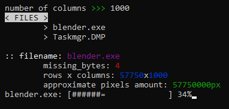
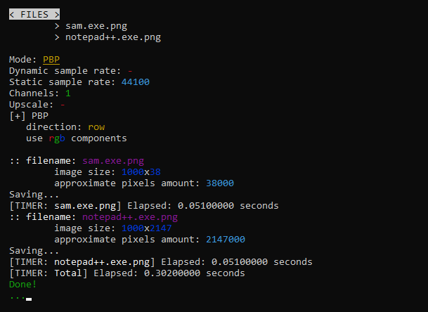
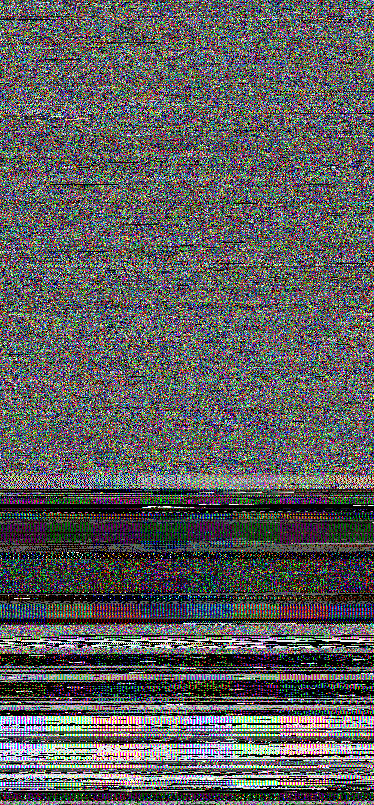
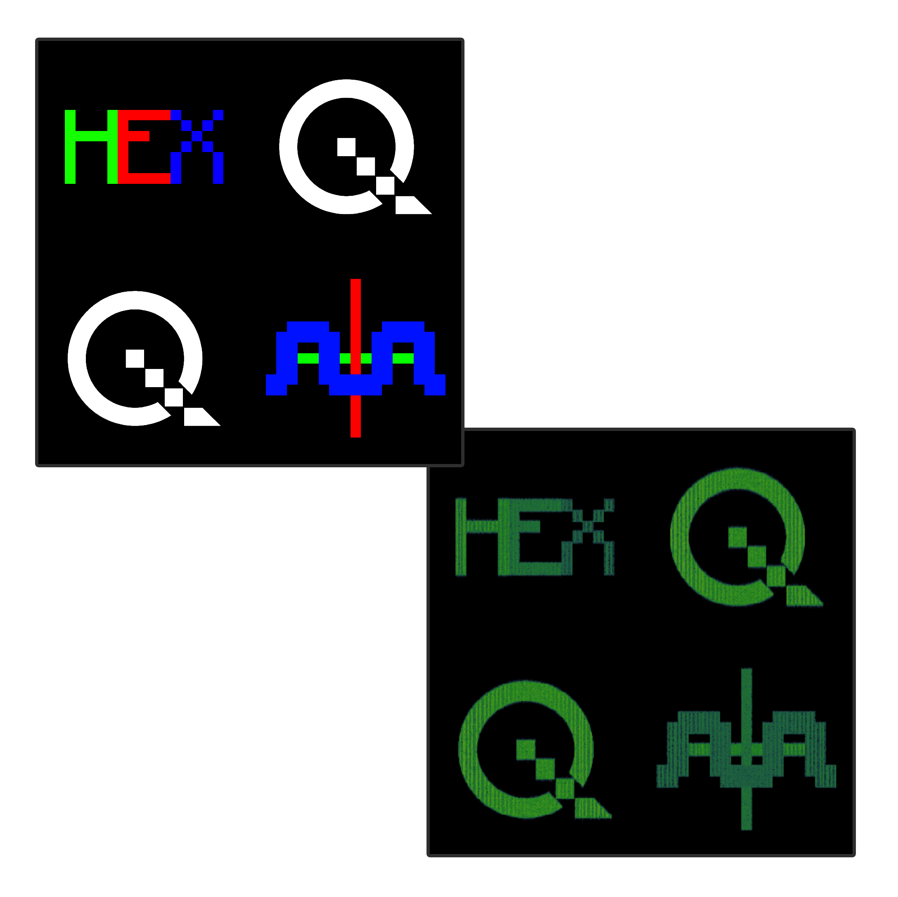

# Version 2.0.0

## HEXng



- Converts _any file_ into _.png_
- Options source: config file

## Wavorizer



- Converts _.png, .jpeg, .jpg_ ( further .{image} ) into _.wav_ in 2 different modes:
1.  PBP [ Pixel by pixel ]
    - Reads RGB components and writes them as .wav amplitudes
    - Options: 
      
option             | arg | description
-------------------|-----|------------
post_filter        | str | apply a filter to each pixel (**none**, **sum**, **mul**, **xor**)
scan_mode          | str | pixel read order (**rows**, **cols**, **zigzag**, **spiral**)
quantization_level | int | quantize colors before processing

2. ISM [ Inverse spectrogram method ]
    - Reads entire .{image} as spectrogram and writes it as _.wav_ amplitudes
    - Must be suitable for many images, but very small and messy images will produce messy result
    - Options: 

option         | arg   | description
---------------|-------|------------
detect_edges   | bool  | use the sobel function to detect the edges of objects
blur_radius    | int   | radius of the blur applid to an image
noise_strength | float | strength of the applied noise
 
- Other options:

option             | arg | description
-------------------|-----|------------
sample_rate_mode   | str | if **static**, `sample_rate` value will be ues, if **dynamic** sample rate will be computed automatically using linear remapping
sample_rate        | int | target sample rate of the output .wav file
channels           | int | mono (1) or stereo (2)
image_scale        | int | if this value is other than 1, then image will be prescaled using this scale factor

- Options source: config file

> **Note:**
> Current max image size is 1e8 ( =  _1 000 000 00_ )
> .{image} with **width** x **height** > 1e8 will be skipped.
> This value is also used for remapping as max value of initial range.
> Look at the sources if you really want to edit it:
> src.wavorizer.app.py :: MAX_IMAGE_LIN_SIZE = 1e8

## Wavovideo

- Renders _.mp4_ video from Wavorizer output using _.spec.json_ files
- Creates scrolling visualization synchronized with audio
- Automatically detects scan mode and adjusts scrolling axis:
  - **PBP rows/zigzag**: vertical scroll
  - **PBP cols**: horizontal scroll
  - **PBP spiral**: not supported yet
  - **ISM**: horizontal scroll
- Options:

option              | arg   | description
--------------------|-------|------------
resolution          | str   | output video resolution (**TINY**, **SMALL**, **MEDIUM**, **LARGE**, **FULLHD**)
fps                 | int   | frames per second
scanner_color       | int   | scanner line and area color (**RED**, **GREEN**, **BLUE**, **WHITE**, **BLACK**, **CYAN**, **MAGENTA**, **YELLOW**)
scan_area_opacity   | float | opacity of the area under the scanning line
scanline_thickness  | int   | line thickness
blend_mode          | str   | blend mode for the scanner (**NORMAL**, **DODGE**, **DIFF**, **COLOR**, **SATUR**, **OVERLAY**)


- Options source: config file
- Requires: FFmpeg installed and available in PATH

> **Note:**
> Processes all valid _.spec.json_ files found in the **in/** folder.
> Files with hash mismatches or unsupported scan modes (spiral) will be skipped.
> Output videos are saved to **out/** folder.

## Complete config structures:

### Wavorizer ( Default values ):
``` JSON
{
    "mode": "PBP",
    "channels": 1,
    "sample_rate_mode": "static",
    "sample_rate": 44100,
    "image_scale": 1,
    "PBP": {
        "sum_rgb_components": false,
        "direction": "rows"
    },
    "ISM": {
        "use_noise": true,
        "noise_strength": 0.5,
        "detect_edges": false
    }
}
```

### Wavovideo ( Default values ):
``` JSON
{
    "resolution": "FULLHD",
    "fps": 4,
    "line_color": "WHITE",
    "line_thickness": 1
}
```

## Installation

### From Release

Pre-built version is available. You can download it from the [Releases](https://github.com/CoMakar/PWLab/releases).

> [!NOTE]
> Executables were built using [PyInstaller](https://pyinstaller.org/en/stable/)
> [Windows 10 x64]

### Build it yourself

> [!NOTE]
> This project uses [Pipenv](https://pipenv.pypa.io/en/latest/) to manage virtual environment and all the dependencies.
> Make sure to install it first.

1. Clone the repository:

    ```bash
    git clone https://github.com/CoMakar/PWLab.git
    cd PWLab
    ```

2. Install with dev dependencies

    ```bash
    pipenv install --dev
    ```

3. Use make file or pyinstaller itself to build the project

    ```bash
    make all
    # - or -
    pyinstaller hexng.spec
    pyinstaller wavorizer.spec
    pyinstaller wavovideo.spec
    ```

4. Navigate to ./dist/ or ./bin/pwlab directory to find the executables

    ```bash
    cd ./bin/pwlab
    ls -> hexng, wavorizer, wavovideo
    cd ./hexng
    ./hexng
    # - or -
    cd ./dist
    ./hexng
    ```

## Examples

### HEXng: `Notepad++.exe`
 

### Wavorizer: `Logo`
 

### Wavorizer: `2B2T Spawn`

